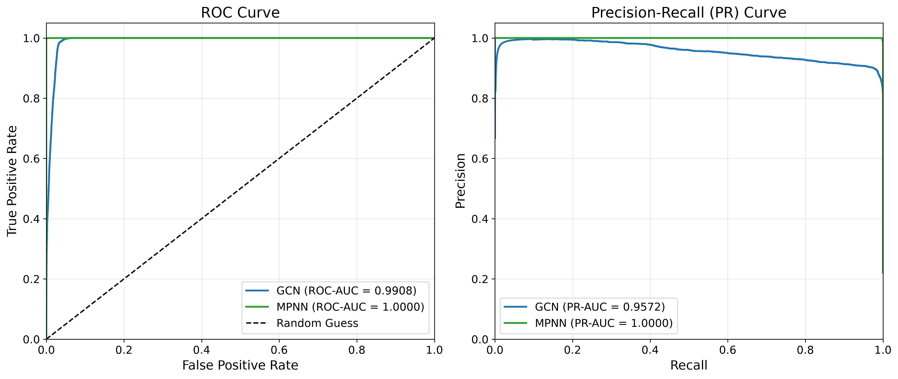
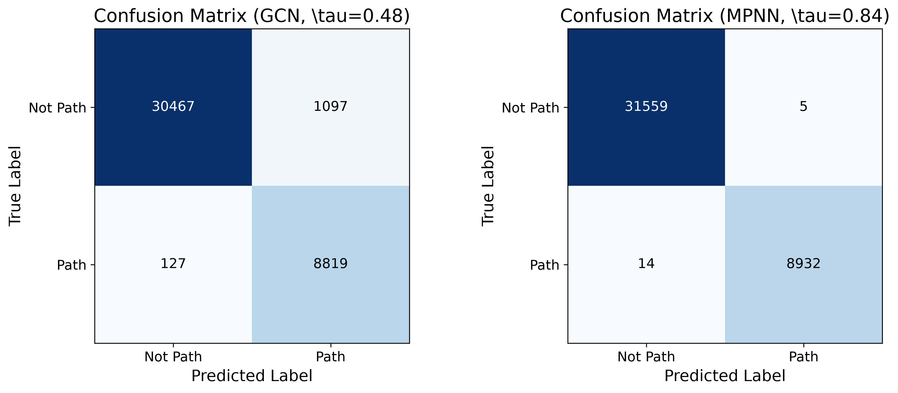
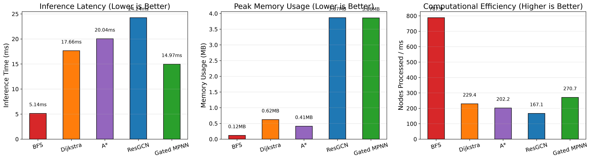
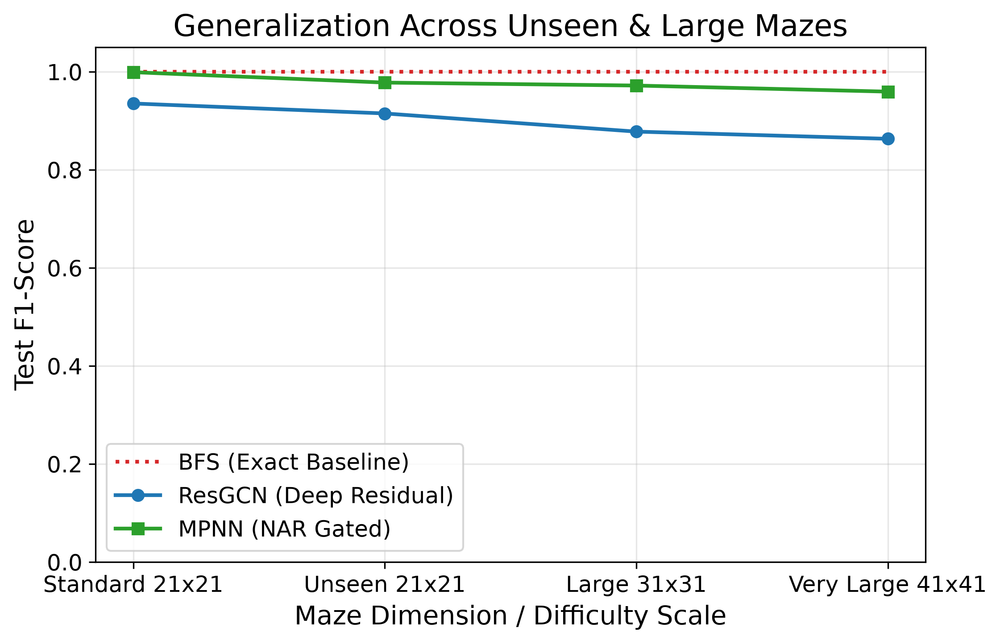
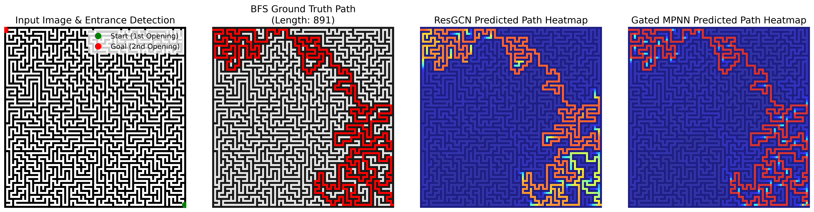

# Neural Algorithmic Reasoning for Maze Solving: A Comparison with Classical Graph Search Algorithms

[](https://www.python.org/)
[](https://pytorch.org/)
[](https://pyg.org/)
[](LICENSE)

An empirical research project evaluating **Neural Algorithmic Reasoning (NAR)** architectures against classical graph search algorithms (**Breadth-First Search**, **Dijkstra**, **A* Search**) on 4-connected grid maze navigation problems.

---

## Abstract & Research Question

> **Research Question:** *To what extent can Neural Algorithmic Reasoning match the accuracy, computational efficiency, and generalization capabilities of classical graph algorithms when solving graph-based problems?*

Classical graph search algorithms (BFS, Dijkstra, A*) guarantee 100% exact shortest paths but lack neural adaptability and continuous feature integration. Neural Algorithmic Reasoning (NAR) trains Graph Neural Networks (GNNs) to learn algorithmic execution representations. This project benchmarks **Deep Residual GCNs (ResGCN)** and **Recurrent Gated Message Passing Neural Networks (GateMPNN)** against classical search under zero test-data leakage and severe class imbalance.

---

## Key Methodological Contributions

1. **Zero Test-Data Leakage**: Classification thresholds ($\tau^*$) are selected strictly on the validation dataset to maximize validation F1-score (`find_optimal_threshold`), and then applied as fixed thresholds across test, unseen, and scale generalization datasets.
2. **Imbalanced Class Evaluation**: Evaluates Precision-Recall Curves (**PR-AUC / Average Precision**), Precision, Recall, F1-Score, ROC-AUC, and Confusion Matrices to account for the ~75% negative class imbalance.
3. **Diameter-Matched Message Passing**: Uses 30 residual layers (ResGCN) and 30 recurrent message passing steps (GateMPNN) matching the grid graph diameter (~100–120 vertices).
4. **Randomized Boundary Entrances**: Automatic detection of Start and Goal entrance openings across all 4 outer maze boundaries using OpenCV.
5. **Optimizer & Loss Function**: Trained using **AdamW** ($\text{lr}=10^{-3}$, $\text{weight\_decay}=10^{-4}$) and **Focal BCE Loss** ($\gamma = 2.0$).

---

## Model Architectures

```mermaid
graph TD
    subgraph ResGCN ["Deep ResGCN (30 Layers)"]
        X1["Input Node Features X (8-dim)"] --> Emb1["Linear Embedding -> h_0"]
        Emb1 --> B1["30 Residual GCN Blocks"]
        B1 --> Cat1["Concat(h_0, h_30)"]
        Cat1 --> Out1["Linear Classifier -> Logits"]
    end

    subgraph GateMPNN ["Recurrent GateMPNN (30 Steps)"]
        X2["Input Node Features X (8-dim)"] --> Emb2["Linear Embedding -> h_0"]
        Emb2 --> Step["MessagePassing Max Aggr"]
        Step --> GRU["GRUCell Update"]
        GRU --> Norm["LayerNorm(h + 0.1*h_0)"]
        Norm --> Loop{"Iterate T=30"}
        Loop -- Repeat --> Step
        Loop -- Done --> Cat2["Concat(h_0, h_30)"]
        Cat2 --> Out2["Linear Classifier -> Logits"]
    end
```



---

## Benchmark Results

Evaluating performance on 21×21 grid graphs under validation-tuned fixed thresholds ($\tau^*_{\text{ResGCN}}=0.520$, $\tau^*_{\text{GateMPNN}}=0.650$):

| Model / Algorithm | Accuracy (%) | Precision (%) | Recall (%) | F1-Score | ROC-AUC (%) | PR-AUC (%) | Latency (ms) | Peak Mem (MB) | Nodes/ms |
| :--- | :---: | :---: | :---: | :---: | :---: | :---: | :---: | :---: | :---: |
| **BFS Baseline** | 100.00 | 100.00 | 100.00 | 1.0000 | 100.00 | 100.00 | 4.65 | 0.13 | 871.3 |
| **Dijkstra** | 100.00 | 100.00 | 100.00 | 1.0000 | 100.00 | 100.00 | 17.19 | 0.62 | 235.6 |
| **A* Search** | 100.00 | 100.00 | 100.00 | 1.0000 | 100.00 | 100.00 | 18.20 | 0.43 | 222.6 |
| **ResGCN (30L)** | **98.63** | **95.51** | **98.85** | **0.9715** | **99.80** | **98.94** | 26.81 | 5.67 | 151.1 |
| **GateMPNN (30S)** | **98.70** | **97.89** | **96.57** | **0.9723** | **99.87** | **99.43** | **12.61** | **5.67** | **321.3** |

---

## Visualizations & Figures

### Classification Performance (ROC & Precision-Recall Curves)


### Calibrated Confusion Matrices


### Computational Profiling & Scale Generalization
| Latency, Memory & Throughput | Scale Generalization (21x21 -> 41x41) |
| :---: | :---: |
|  |  |

### Visual Maze Overlay & Solution Heatmaps


---

## Quick Start & Usage

### 1. Installation
```bash
git clone https://github.com/huseyn77/nar-vs-classical-search.git
cd nar-vs-classical-search
pip install -r requirements.txt
```

### 2. Run Main Experiment Pipeline
```bash
python main.py
```

### 3. Open Interactive Jupyter Notebook
```bash
jupyter notebook neural_algorithmic_reasoning_maze.ipynb
```

---

## References

- **Veličković, P., et al. (2021)**. The CLRS Algorithmic Reasoning Benchmark. *ICML / arXiv:2105.15197*.
- **Battaglia, P. W., et al. (2018)**. Relational inductive biases, deep learning, and graph networks. *arXiv:1806.01261*.
- **Xu, K., Hu, W., Leskovec, J., & Jegelka, S. (2019)**. How Powerful are Graph Neural Networks? *ICLR*.
- **Cormen, T. H., Leiserson, C. E., Rivest, R. L., & Stein, C. (2009)**. *Introduction to Algorithms* (3rd ed.). MIT Press.
- **Georgiev, D. G. (2023)**. *Neural Algorithmic Reasoning in a Bottle(neck)*. University of Cambridge Thesis.

---

## 📄 License
-This project is licensed under the MIT License — see the [LICENSE](LICENSE) file for details.
